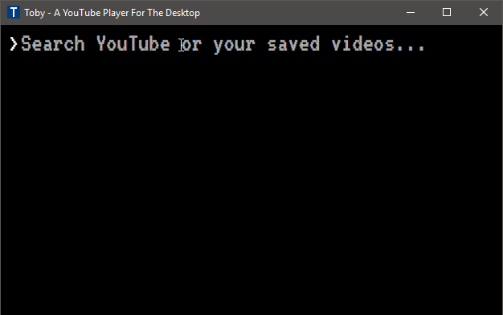
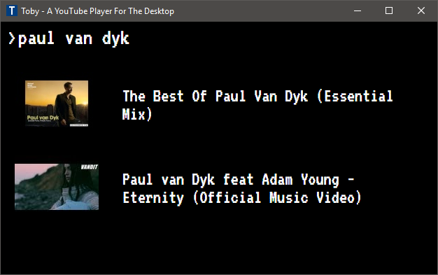
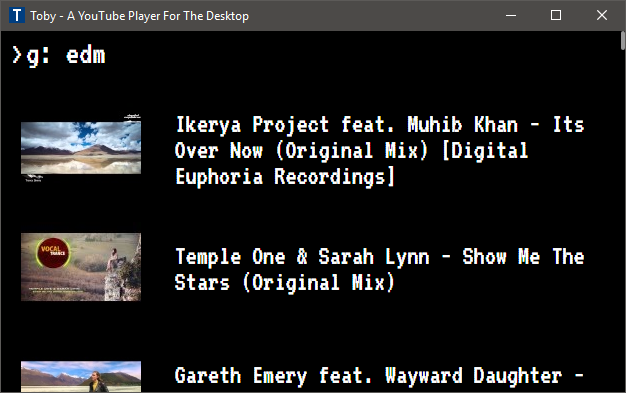
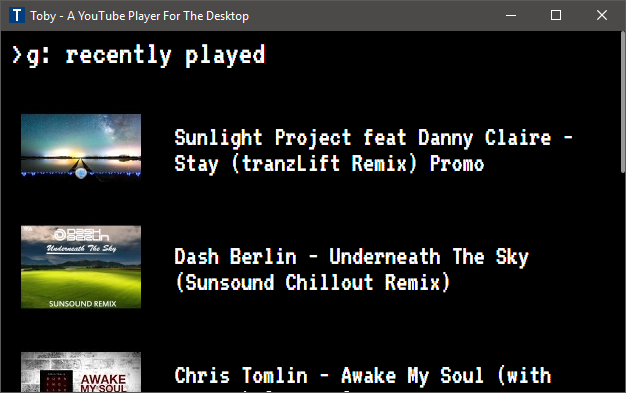
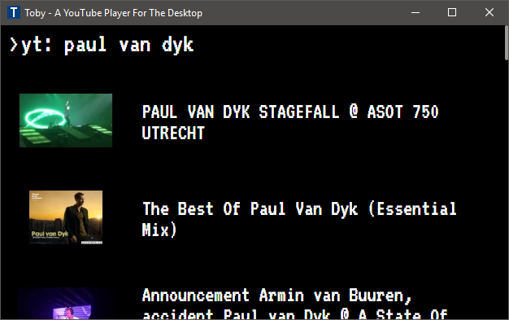
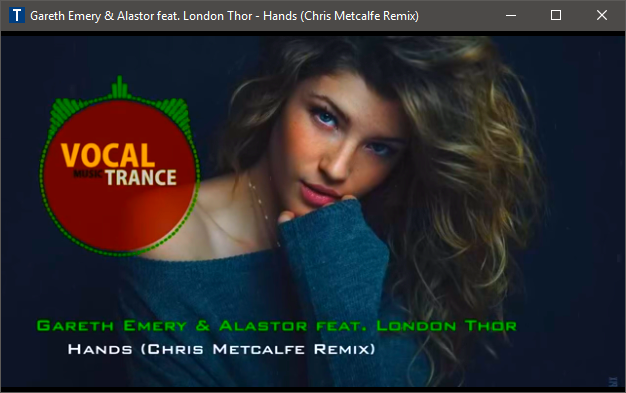
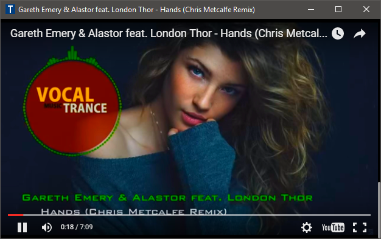

# Toby

[](https://gitter.im/frankhale/toby?utm_source=badge&utm_medium=badge&utm_campaign=pr-badge&utm_content=badge)

Toby is a YouTube player for the desktop.

### Screenshots

Toby In Action:



Search Local Videos:



Search Local Group Videos:



List Recently Played Videos:



Search YouTube Videos:



Video Playback:



Video Playback (YouTube's transparent look and feel default):



### How can I run this code?

***In lieu of a current release (coming soon!) you'll have to build the code yourself.***

Install [Node](http://nodejs.org), [Bower](http://bower.io) and [Grunt](http://gruntjs.com/)

Get all the node modules:

```
npm install
```

Get all the front end modules:

```
bower install
```

Build the code:

```
grunt
```

Run:

```
npm start
```

### Usage

**Important Key Combos:**

<kbd>F5</kbd> - Add the current playing video to data.json (see section 'Updating the data file')  
<kbd>F6</kbd> - Toggle black and white video playback filter  
<kbd>F7</kbd> - Toggle saturated video playback filter  
<kbd>F8</kbd> - Toggle sepia video playback filter  
<kbd>F9</kbd> - Remove video playback filter  
<kbd>Ctrl</kbd> + <kbd>R</kbd> - Restart app (Still leaving this in here for debug purposes)  
<kbd>Ctrl</kbd> + <kbd>Shift</kbd> + <kbd>I</kbd> - Open Developer tools (Still leaving this in here for debug purposes)

### Things still not implemented since rewrite

- Caching YouTube search results for a bit to avoid querying YouTube over and over for the same thing
- Usage info from within the app
- Hiding of (annoying) annotations on YouTube videos

### Updating the data file

The data format for your favorite videos is very simple. The data file located in the data folder is called 'data.txt'. It can contain one or more groups. The 'Recently Played' group is special and will be added if it's not present hold the last 30 videos you've recently played.

Data Format:

```
Group Name {
  Video Title : Video Id
}
```

See real example below:

```
Recently Played {
  Sunlight Project feat Danny Claire - Stay (tranzLift Remix) Promo : yWQvWTM7Hqg
  Dash Berlin - Underneath The Sky (Sunsound Chillout Remix) : UEqMD-5urik
  Chris Tomlin - Awake My Soul (with Lecrae) [Lyrics] : fWpvknKuYrg
  Chris Tomlin - Good Good Father (Live at the Grand Ole Opry) : eaqaER7dasY
}
```

## Author(s)

Frank Hale &lt;frankhale@gmail.com&gt;  
16 March 2016

## License

GNU GPL v3 - see [LICENSE](LICENSE)
