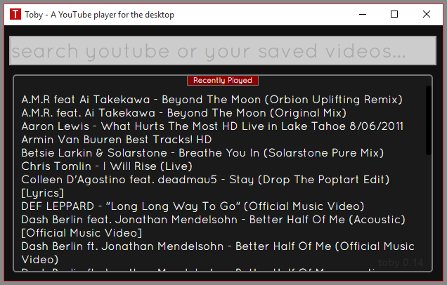
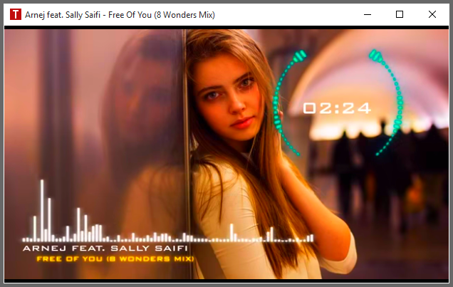
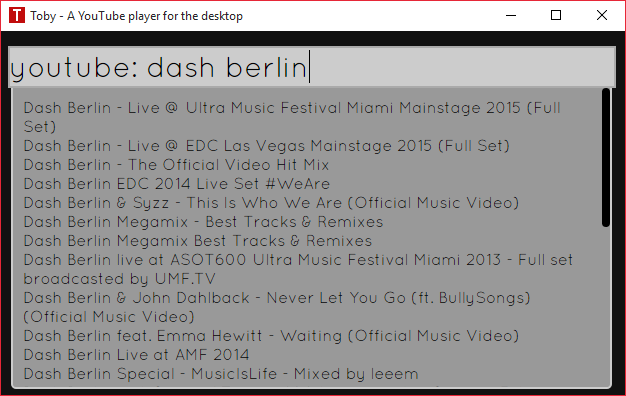
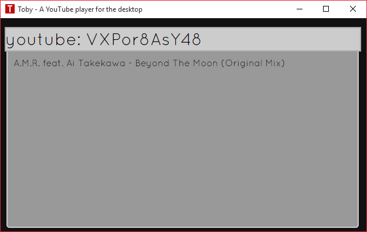

Toby
====

Toby is a YouTube player for the desktop that strives to be simple, elegant and
not get in your way. You have videos you like and Toby wants it to be as
painless as possible for you to start watching videos now!

##Screenshots

Main user interface:



Video playback:


Video playback (Saturated):



Video playback (Black & White):


Search YouTube:



Play any video via it's YouTube video ID:



Search your playlist for a video:

List all videos that start with the search term.


List all videos in your playlist:

By typing "group: all" into the search box you will get a listing of all of your
videos.


List videos by group name:

By prefixing your search with "group:" you can get a listing of all videos in a specific
group.


##Current Release

https://github.com/frankhale/toby/releases/tag/v0.14.0

A Windows x64 binary has been provided in this release.

- Based on Electron 0.29.2-master (after the 0.29.2 release), includes iojs 2.3.4
and a patched libchromiumcontent to Chrome version 43.0.2357.132 as well as a
patch to override the HTTP referrer so that videos blocked from playback by at least
VEVO will play.

Developer Note: This custom HTTP referrer override patch is different than the
httpreferrer override option in the webview tag. This one overrides the referrer
for all web requests.

##Default Play List

I ship my play list with Toby as an example. Feel free to replace this with
videos you love!

##Usage

**Important Key Combos:**

F1 - Switch between video search and video playback (once a video has been selected and is playing)  
F5 - Add the current playing video to data.json (see Updating data.json)  
F7 - Toggle black and white video playback filter  
F8 - Toggle saturated video playback filter  
F9 - Toggle sepia video playback filter  
Ctrl + R - Restart app (Still leaving this in here for debug purposes)  
Ctrl + Shift + I - Open Developer tools (Still leaving this in here for debug purposes)

NOTE: F5 adds a video to data.json only if it doesn't already exist. At the end
of playing a YouTube video you'll receive suggestions for related videos that you
may want to watch. If you click these videos and you like them you can press F5
to add the video to your play list.

###How can I update the play list?

Currently you can update your playlist with new videos in three ways. The data for
all your saved videos is in a file called data.json. I've included my favorite
videos as an example in this release to get you started.

NOTE Location: toby-0.14.0\resources\app\assets\data\data.json

1. Update data.json manually (see below)
2. Search Youtube by prefixing your search with "youtube:" or "yt:" and then
   using the F5 key to add a video you like to your playlist.
3. After a video is played YouTube will show a listing of other videos you may
   like to watch. If you click on one and like it you can hit the F5 key to add
   it to your playlist. This will make it available when searching your videos
   the next time you want to watch it. Files added in this way will be added to
   a group called 'misc'. If you like you can edit your data.json and move them
   to a different group. A UI will be provided in the future to make this easier.

Updating data.json manually:  

The data folder has a JSON file in it which is pretty self explanatory. There
is an array of genres which have a set of videos that go with them. Basically
what you do is you just grab the title of the video and the video ID from the
video URL on YouTube and add it manually to the file. You can do this while the
app is running and the new entry will show up in your play list.

The data.json file has the following format:

There is just one big array of video groups, groups contain the title of the
groups and the videos associated with it. Videos are just an array of files
that contain a description and a URL.

```json
[{  
  "title": "Trance",
  "videos": [{
    "description": "Dash Berlin - Underneath The Sky (Sunsound Chillout Remix)",
    "ytid": "UEqMD-5urik"
  }, {
    "description": "Jasper Forks - River Flows In You (Out of Blackout Vocal Edit) [HD]",
    "ytid": "5UwnhliP5N8"
  }, {
    "description": "Dash Berlin ft. Christon Rigby - Underneath The Sky (ASOT 667 Official Preview) #WeAre",
    "ytid": "8X3XhQS-ZtA"
  }]
}]
```

###Some videos are blocked (VEVO), why?

From 0.13.0 forward I'm using the YouTube API so this requires a custom patch for
libchromiumcontent so that the HTTP referrer is overridden for all web requests.
Thus allowing blocked videos (from VEVO) to play (because the YouTube API requires an iframe
and the httpreferrer override option only exists in webviews for a single HTTP source).

I will provide the necessary information for those developers inclined to patch
their own libchromiumcontent until the time I can release a full fledged API to do
this back to upstream Electron.

##Running Latest Code (not using the provided release binary)

If you want to run the latest code from master feel free. Toby requires
Electron to run.

How to run master in Electron:

- Download Electron from https://github.com/atom/electron
- Unzip Electron
- Navigate to the resources folder
- Create a folder called app
- Clone the source code using git or download a copy of this code from Github
and dump it directly in the app folder
- Open terminal to app folder
- Run npm install to install node modules (requires iojs or node to be installed)
- Run bower install to install JavaScript dependencies (requires bower to be installed)
- Run Electron
- Enjoy life and have fun listening to awesome music (or watching videos you love) on YouTube!

##Author(s)

Frank Hale &lt;frankhale@gmail.com&gt;  
16 July 2015

##License

GNU GPL v2 - see LICENSE.txt
