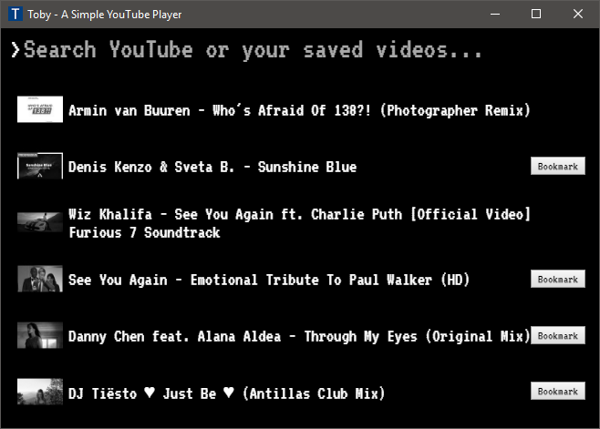
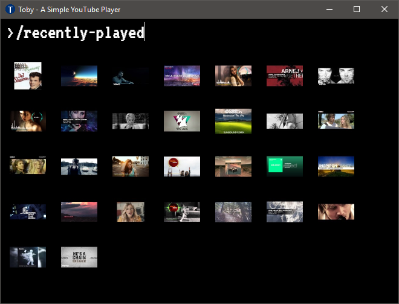
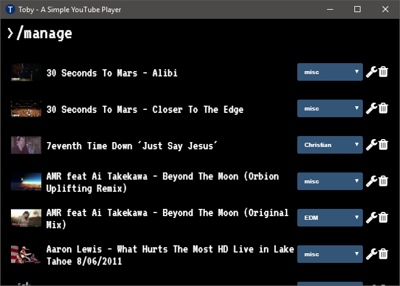
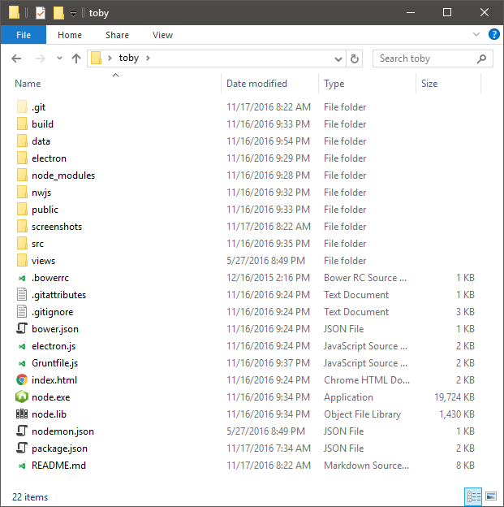

# Toby

[](https://gitter.im/frankhale/toby?utm_source=badge&utm_medium=badge&utm_campaign=pr-badge&utm_content=badge)

Toby is a YouTube player for the desktop.

### Screenshots

Toby In Action:


Toby Main UI:


Toby Video List:



Toby Video List (Slim Grid)



Toby Recently Played:


Toby Manage Videos:



Toby Server Log:


### Architecture

The old Toby architecture was geared towards an Electron deployment and I loaded
all the code from the file system. The new architecture puts Toby behind an
Express web application that is spawned from a regular Node process so that more
deployment scenarios are possible.

A Toby deployment would ship the regular `node.exe` and `node.lib` files along 
side the source code. We know NW.js and Electron ship with Node embedded but 
shipping Node as an external resource allows us to run Toby's server in a 
regular Node process and unencumbered by NW.js / Electron specific compiling 
requirements for any potential native Node modules we may want to use nor or in 
the future. The only native Node module being at the moment is SQLite3.

Having Toby behind an Express app makes it fairly trivial to deploy to NW.js,
Electron and support a regular web browser.

Toby is meant as a personal application running on a personal computer and it's
web API is not password protected in any way and there has been no attempt to
protect the data Toby collects. Toby only cares about a few things, namely
YouTube video titles, YouTube video IDs and the groups you decide to store your
favorite videos in.

### How can I run the latest code?

Set up the folder structure for working with either NW.js or Electron or both:



Notice that we have a copy of `node.exe` and `node.lib` in the root of the 
source code repository. This is used to spawn our server for serving our API.

Additionally we have a folder named `browsers` with a copy of `electron` and/or 
`nwjs`. We'll use one of these to run Toby.

#### Dependencies

- Node : [http://nodejs.org](http://nodejs.org)
- Grunt : [http://gruntjs.com](http://gruntjs.com)
- Bower : [http://bower.io/](http://bower.io/)
- Webpack : [https://webpack.github.io/](https://webpack.github.io/)
- Typescript : [http://typescriptlang.org/](http://typescriptlang.org/)

## You Just Need One of the following:

- Electron: [http://electron.atom.io/](http://electron.atom.io/)
- NW.js: [http://nwjs.io/](http://nwjs.io/)

In addition to installing Node on your machine so you can download the
dependencies and build the code you'll also need a copy of the Node binaries to
place at the root of the source code folder. This is because when NW.js or
Electron are executed they will spawn their own external Node process and start
the Toby server.

The required Node binaries are located here (for example):

[https://nodejs.org/dist/v7.2.1/win-x64/](https://nodejs.org/dist/v7.2.1/win-x64/)

Depending on what platform you want to run Toby in (Electron or NW.js) you'll
need to make sure the main property in package.json is set accordingly:

##### NW.js

```
main: "index.html"
```

##### Electron

```
main: "electron.js"
```

In order to run Toby you'll need to download the dependencies and build the
source code. Open a terminal to the source code repository and run the following
commands.

#### Install dependencies  

```
npm install -g webpack
npm install -g typescript
npm install -g grunt
npm install   
bower install
```

#### Help SQLite3 is being stupid

If you are running on Windows and Toby won't work correctly because the SQLite3
module didn't install all of the required binaries you can try this:

Download the missing module:
[https://mapbox-node-binary.s3.amazonaws.com/sqlite3/v3.1.8/node-v48-win32-x64.tar.gz](https://mapbox-node-binary.s3.amazonaws.com/sqlite3/v3.1.8/node-v48-win32-x64.tar.gz)

Copy it to `node_modules\sqlite3\lib\binding`


***BEFORE BUILDING***

Before building the source code you'll need to copy over the Typescript 
definition files that I've made for the `youtube-search` and `title-case`. This 
file is located in `/definitions/youtube-search.d.ts` and needs to be copied to 
`/node_modules/youtube-search` and rename it to `index.d.ts`. The `title-case` 
one should be copied to `/node_modules/title-case`.

The `title-case` definition is just a modification of the one that already 
exists but makes one change so that it can be imported using the import keyword.

#### Building the Source Code

The server needs to be built using Grunt.

```
grunt
```

The front end needs to be build using Webpack.

```
webpack
```

Assuming all dependencies are downloaded and the source code has been compiled
perform the following from a command line at the root of the Toby code 
repository:

***NOTE: `main` will need to be updated in `package.json` to point to the 
correct starting point for your deployment scenario. If you are using Electron 
it will need to be set to `build\electron.js` or if you are using NW.js it'll 
need to be set to `build\index.html`. It should also be noted that the 
index.html contained in the root of the Toby repository will be copied to the 
build folder and used from there.***

#### Running in NW.js

```
browser\nwjs\nw.exe .
```

#### Running in Electron

```
browser\electron\electron .
```

#### Running in a Browser

Start the server up:

```
.\node.exe build/server.js
```
Then open a browser to `http://127.0.0.1:62374`

### Usage

**Important Key Combos:**

<kbd>F1</kbd> - Toggles server log   
<kbd>F11</kbd> - Toggles Fullscreen

In addition to keyboard shortcuts there are commands that can be typed into the
search box that will perform various things.

Here is a list (there will be additional ones added soon):

- `[name hint]` : Lists locally saved videos based on the [name hint]
- `[search term]` : Searches YouTube for the [search term]
- `/local [search term]` : Searches for locally saved videos
- `/g [group name]` : Lists the videos for the [group name]
- `/list-all` : List all videos contained in the database
- `/history` : Lists the recently played videos
- `/rp` or `/recently-played` : List last 30 recently played videos
- `/rps` or `/recently-played-search` : Search recently played videos
- `/manage` : Manage what groups videos are in and also provide ability to 
delete videos
- `/archive` : Export the contents of the database to the data.txt file
- `/gv` or `/grid-view` - Toggle slim grid view for search results
- `/dv` or `/default-view` - Toggle default view for search results
- `/clear` : Clears search results
- `/monochrome` : (NW.js/Electron only) Short cut to set the monochrome video 
filter and thumbnails in search results
- `/saturate` : (NW.js/Electron only) Short cut to set the saturated video 
filter and thumbnails in search results
- `/sepia` : (NW.js/Electron only) Short cut to set the sepia video filter and
thumbnails in search results
- `/normal` : (NW.js/Electron only) Short cut to set the normal video filter and
thumbnails in search results
- `/filter monochrome` : (NW.js/Electron only) Short cut to set the monochrome 
video filter and thumbnails in search results
- `/filter saturate` : (NW.js/Electron only) Short cut to set the saturated 
video filter and thumbnails in search results
- `/filter sepia` : (NW.js/Electron only) Short cut to set the sepia video 
filter and thumbnails in search results

***NOTE: You can refer to /src/toby-ui.tsx for the various short cuts available
for these commands***

### Wait, I used NW.js and some YouTube videos won't play

The FFMPEG library that ships with NW.js is less capable than the one that ships
with Electron. The short answer is just copy the FFMPEG library from an Electron
release replace the one that ships with NW.js. I've been doing this for a long 
time and it works well for me (on Windows). 

The longer answer is you can compile your own FFMPEG library with the support 
you and there are a lot of resources already out there to handle this scenario.

***NOTE: This technique does not work with NW.js 0.20.0-beta1 as the FFMPEG 
seems to be different than one that ships with Electron.***

Looks like there are some alternate FFMPEG builds available which can take care 
of this: [https://github.com/iteufel/nwjs-ffmpeg-prebuilt/releases](https://github.com/iteufel/nwjs-ffmpeg-prebuilt/releases)

### Features TODO

- Usage info from within the app

### Updating the data file

I've removed the ordinary data file as it was too cumbersome to get the parser
correct. I've decided to just define some basic starting video data in the
following code file `/src/data.ts`. If you are building from source feel free to
edit this to your liking. If at anytime you edit this file and run Toby it will
update your database importing any new videos you put there.

***NOTE: Although it hasn't been done yet it'd be trivial to replace this with JSON 
data loaded from the filesystem.***

## Author(s)

Frank Hale &lt;frankhale@gmail.com&gt;  
20 April 2017

## License

GNU GPL v3 - see [LICENSE](LICENSE)
