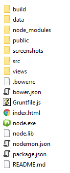

# Toby

[](https://gitter.im/frankhale/toby?utm_source=badge&utm_medium=badge&utm_campaign=pr-badge&utm_content=badge)

Toby is a YouTube player for the desktop.

## Status

Heavy development! Things are in a state of flux. All efforts right now are in
the NW.js build and everything else to follow... The README is primitive right now!

### Screenshots

Toby In Action:


Toby Video List:


Toby Server Log:


### How can I run this code?

Toby is becoming more generic and not just for Electron. In a perfect world Toby
will run in Electron, NW.js and in a web browser. That said, it takes time to
make sure all environments keep up. At the moment I am concentrating on
delivering NW.js support. When I get finished with NW.js I will work on
Electron. Likewise for web but I've already done a bunch of work to make sure it
works on web so that should still be working. Please note that it's highly
likely that this 'rewrite' branch is broken at any given time but I will do my
best to make sure it's not.

All that said, I use Toby all the time so if things are broken they probably
won't stay broken for long.

It should be noted that these instructions are for the impatient and that a
proper distribution will be created and released that is easy to get up and running and requires none of the instructions that are or will be listed below.

#### Dependencies

- Node : http://nodejs.org
- Grunt : http://gruntjs.com
- Bower : http://bower.io/

In addition to installing Node on your machine so you can download the dependencies and build the code you'll also need a copy of the Node binaries to place at the root of the source code folder. This is because when NW.js and eventually the Electron build are executed they will spawn a Node process and start the Toby server. The requirement to ship the two Node binaries is so that
we can support machines that don't have Node installed (this is for the time
when a proper distribution will be available).

The required Node binaries are located here (for example):

https://nodejs.org/dist/v6.0.0/win-x64/

Here is what the directories look like:

NW.js root dir:


package.nw dir:



Install dependencies  

```
npm install   
bower install
```

The code needs to be built using Grunt  

```
grunt
```

Running in NW.js

- Download a copy of NW.js from : nwjs.io
- Unzip NW.js
- Create package.nw directory inside the unzipped NW.js folder
- Copy the Toby distribution files to the package.nw
- Install all Toby dependencies using npm and bower (see above)
- Build Toby using grunt (see above)
- Double click the nw.exe in the NW.js unzipped folder

Running in Electron

TODO

Running in a web browser

TODO

### Usage

**Important Key Combos:**

<kbd>F1</kbd> - Toggles server log  
<kbd>F5</kbd> - Usage Info (NOT IMPLEMENTED YET)  
<kbd>F11</kbd> - Toggle Fullscreen

### Features TODO

- Caching YouTube search results for a bit to avoid querying YouTube over and
  over for the same thing
- Usage info from within the app
- Add `/import` to import new videos in the data.txt file

### Updating the data file

Unlike previous versions of Toby the data.txt file located in the data folder is
now only used initially to create the database which stores your favorite
videos. Videos stored in the database can be exported by entering the `/archive` command in the search box. A corresponding `/import` command has not been implemented
yet.

The data format for your favorite videos is very simple. It can contain one or
more groups. The 'Recently Played' group is special and will be added if it's
not present hold the last 30 videos you've recently played.

Data Format:

```
Group Name {
  Video Title : Video Id
}
```

See real example below:

```
Recently Played {
  Sunlight Project feat Danny Claire - Stay (tranzLift Remix) Promo : yWQvWTM7Hqg
  Dash Berlin - Underneath The Sky (Sunsound Chillout Remix) : UEqMD-5urik
  Chris Tomlin - Awake My Soul (with Lecrae) [Lyrics] : fWpvknKuYrg
  Chris Tomlin - Good Good Father (Live at the Grand Ole Opry) : eaqaER7dasY
}
```

## Author(s)

Frank Hale &lt;frankhale@gmail.com&gt;  
7 May 2016

## License

GNU GPL v3 - see [LICENSE](LICENSE)
