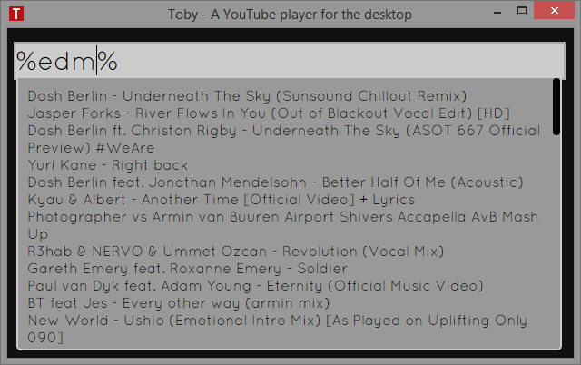

Toby
====

Toby is a desktop YouTube video player. Toby takes the path of least resistance.
It provides a way to specify videos and a way to look them up and play them.
Nothing more, nothing less. Getter done! Play the videos you really like and
love life!

##Screenshots

Video playback:


Search your playlist for a video:

List all videos that start with the search term.


List all videos in your playlist:

By typing %all% into the search box you will get a listing of all of your
videos.


List videos by group name:

By wrapping your video group with % you can get a listing of all videos in a
specific group.



Recently played list:


##Dependencies

If you want to run the latest code from master feel free. Toby requires
Electron to run.

How to run master in Electron:

- Download Electron from https://github.com/atom/electron
- Unzip Electron
- Navigate to the resources folder
- Create a folder called app
- Clone the source code for Toby and dump it directly in the app folder
- Run Electron
- Enjoy life and have fun listening to awesome music on YouTube!

##Release(s)

New release is coming based on Electron!

Until then you can try Toby on Windows via the 0.8 release located here which is
using an old version of Atom-Shell:

https://github.com/frankhale/toby/releases/tag/v0.8.0

I've made a Windows binary available which packages Toby and Atom-Shell
together and will make it super simple to get started.

NOTE: Mac & Linux binaries will come in the future

##Usage

The data folder has a JSON file in it which is pretty self explanatory. There
is an array of genres which have a set of videos that go with them. Basically
what you do is you just grab the title of the video and the embed URL from
YouTube and add it manually (for now) to the file. You can do this while the
app is running and the new entry will show up in your play list.

NOTE: See section Updating data.json for more information.

The data.json file has the following format:

There is just one big array of video groups, groups contain the title of the
groups and the videos associated with it. Videos are just an array of files
that contain a description and a URL.

```json
[{  
  "title": "Trance",
  "videos": [{
    "description": "Dash Berlin - Underneath The Sky (Sunsound Chillout Remix)",
    "url": "UEqMD-5urik"
  }, {
    "description": "Jasper Forks - River Flows In You (Out of Blackout Vocal Edit) [HD]",
    "url": "5UwnhliP5N8"
  }, {
    "description": "Dash Berlin ft. Christon Rigby - Underneath The Sky (ASOT 667 Official Preview) #WeAre",
    "url": "8X3XhQS-ZtA"
  }]
}]
```

Key combos:

F1 - Switch between video search and video playback  
F3 - Restart app  
F5 - Add the current playing video to data.json (see Updating data.json)  
F12 - Open Developer tools

##Updating data.json

Currently you can update data.json with new videos in two ways.

1. Update data.json manually
2. After a video is played YouTube will show a listing of other videos you may
   like to watch. If you click on one and like it you can hit the F5 key to add
   it to your data.json. This will make it available when searching your videos
   the next time you want to watch it. Files added in this way will be added to
   a group called 'misc'. If you like you can edit your data.json and move them
   to a different group.

##Author(s)

Frank Hale &lt;frankhale@gmail.com&gt;  
11 June 2015

##License

GNU GPL v2 - see LICENSE.txt
