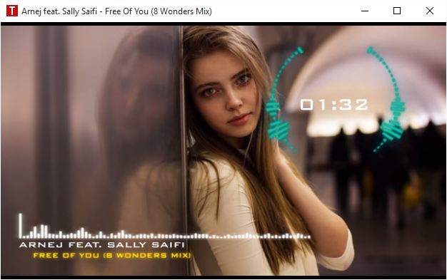
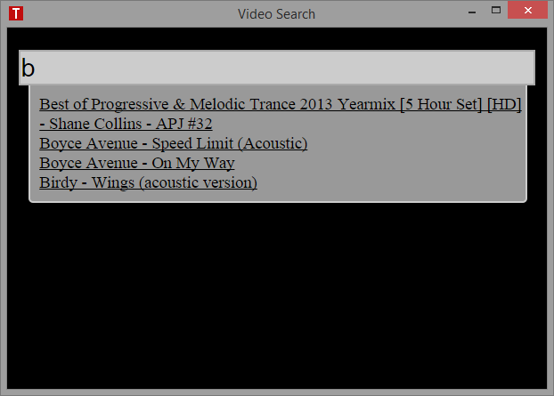
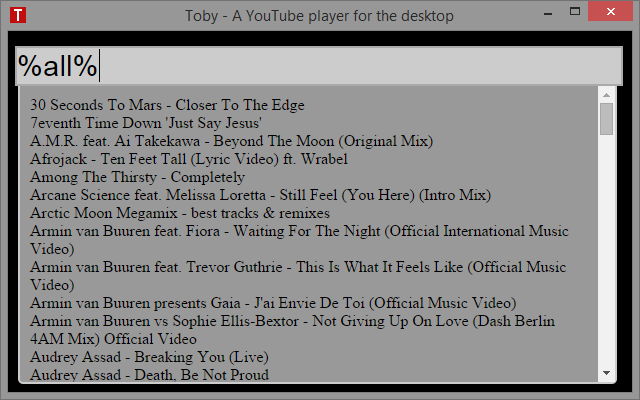
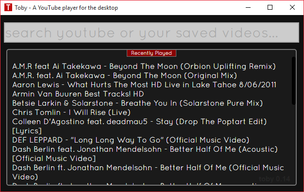

Toby
====

A small and simple YouTube video player written for Atom-Shell. Toby takes the
path of least resistance. It provides a way to specify videos and a way to
look them up and play them. Nothing more, nothing less. Getter done! Play the
videos you really like and love life!

##Screenshots

Video playback



Search your playlist for a video



List all songs in your playlist



Recently played list



##Dependencies

Toby is written in JavaScript / HTML and CSS and needs Atom-Shell to run:

https://github.com/atom/atom-shell

##Release(s)

0.7.0 - https://github.com/frankhale/toby/releases/tag/v0.7.0

I've made a Windows binary available which packages Toby and Atom-Shell together and
will make it super simple to get started.

NOTE: I'd gladly accept Linux and/or Mac binaries, please let me know if you can 
assist!

##Requirements

Atom-Shell

##Usage

The data folder has a JSON file in it which is pretty self explanatory. There is
an array of genres which have a set of videos that go with them. Basically what
you do is you just grab the title of the video and the embed URL from YouTube
and add it manually (for now) to the file. You can do this while the app is
running and the new entry will show up in your play list.

The data.json file has the following format:

There is just one big array of video groups, groups contain the title of the groups
and the videos associated with it. Videos are just an array of files that contain a
description and a URL.

```json
[{  
  "title": "Trance",
  "videos": [{
    "description": "Dash Berlin - Underneath The Sky (Sunsound Chillout Remix)",
    "url": "http://www.youtube.com/embed/UEqMD-5urik"
  }, {
    "description": "Jasper Forks - River Flows In You (Out of Blackout Vocal Edit) [HD]",
    "url": "http://www.youtube.com/embed/5UwnhliP5N8"
  }, {
    "description": "Dash Berlin ft. Christon Rigby - Underneath The Sky (ASOT 667 Official Preview) #WeAre",
    "url": "http://www.youtube.com/embed/8X3XhQS-ZtA"
  }]
}]
```

Key combos:

F1 - Switch between video search and video playback  
F3 - Restart app  
F12 - Open dev tools

##NOTE

As of Atom-Shell 0.19.2 the Http Referrer patch that I wrote has been incorporated and
videos that are blocked due the referrer not being set will now work. I won't mention
any names of publishers that do this but there is a major one and it now works!

##Author(s)

Frank Hale &lt;frankhale@gmail.com&gt;  
1 February 2015

##License

GNU GPL v3
